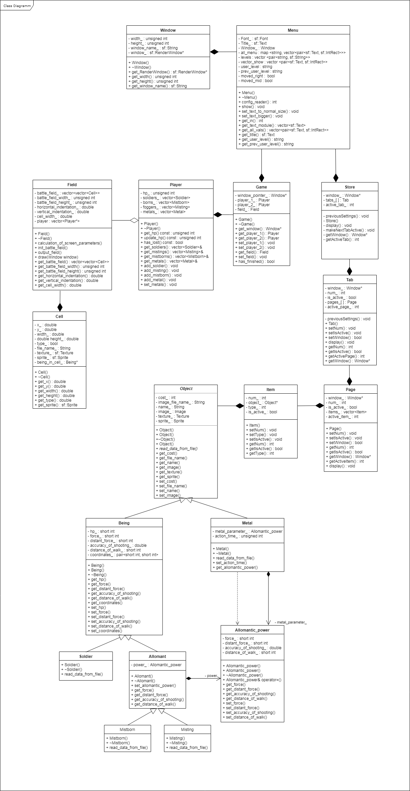

# Новая_стратегия_1



### Основные классы


* Рожденные туманом (class Mistborn)

* Туманщики (class Misting)

* Солдаты (class Soldier)


### Основные методы:

* Загрузка данных персонажа из файла

```
void read_data_from_file(std::string object_name);
```

В качестве аргумента нужно передавать имя объекта (!!!)

##### Пример:

Необходимо считать данные в объект "b" класса "Mistborn" из
файла /game_data/objects/beings/allomancy/mistborn/test_mistborn_1.txt

```
{
Mistborn b;
b.read_data_from_file("test_mistborn_1");  //  полный путь не указывать, достаточно только названия объекта
}
```

get - методы:
```
short int get_hp() const;  // здоровье
short int get_force() const;  // сила ближнего удара
short int get_distant_force() const;  // сила дальнего удара
double get_accuracy_of_shooting() const;  //  меткость стрельбы
short int get_distance_of_walk() const;  //  дальность хода
```

Создавать новые объекты можно через консольный "стострочник":

/game_data/objects/add_object

Прога сама сохранит объект в нужной папке и заполнит .txt файлик

### Задачи на текущую неделю

- [ ] удалить свои старые ветки и создать новые, наследуясь от master -- all
- [ ] поправить код в Player и Game -- @nmerk
- [ ] поправить архитектуру меню -- @smet1
- [ ] написать тесты на связи -- @nmerk @Tsaanstu (боевка) @gleensande (покупки в магазине)
- [ ] написать графику для магазина -- @gleensande 

